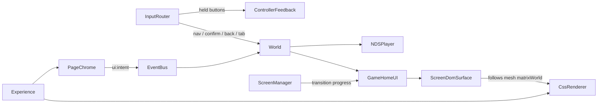

# Phase 7 视觉精修：苹果官网风格页面 + 可操控的 Game Mode UI

## 已确认的决定

- 3D 场景一起改成明亮棚拍，贴近 `public/target.png`。
- 屏幕内 UI 用真实 DOM，通过 `CSS3DRenderer` 投影到 `Top_Screen_Plane` / `Bottom_Display_Plane` 上。
- 只用 D-Pad / 键盘 / 手柄操作。屏幕 DOM 设为 `pointer-events: none`，所以原来在下屏点击 Continue 的功能会随 Canvas UI 一起移除。
- 页面范围：上屏 Home（游戏卡片轮播 + Continue）和 Library（游戏网格），下屏是辅助菜单。
- 封面图以后由你提供，先用渐变色块占位。
- 进入 Playing 后，导航、主标题和卡片淡出，只保留一个小的返回按钮。

## 架构

渲染分工：
- Phone Mode、Game Changer 的手机 UI 淡出部分、Playing（NDS 画面）继续由 WebGPU 渲染。
- Game Home 由 DOM 层渲染。

## 1. CSS3D 屏幕层（基础设施）

- 新增 [src/js/Core/CssRenderer.js](src/js/Core/CssRenderer.js)，由 `Experience` 创建并持有：自己的 `cssScene` 和 `CSS3DRenderer`，DOM 叠在 WebGPU Canvas 上方。`Experience.update()` 在 `camera.update()` 之后调用它的 render；resize 和 destroy 接入现有路径。
- 新增 [src/js/World/Screens/ScreenDomSurface.js](src/js/World/Screens/ScreenDomSurface.js)：从屏幕网格的 UV 解出"UV 到局部坐标"的仿射映射，再套用已经校准过的纹理朝向（上屏沿用 `PhoneScreenSurface` 的 `gameRotation` / 镜像参数，下屏沿用原 Controller 纹理的 -90° + 镜像），得到 DOM 元素左上、右上、左下三个角对应的局部坐标，并由此建立对齐矩阵。之后每帧执行 `cssObject.matrixWorld = mesh.matrixWorld × align`。DOM 元素按接近屏幕实际显示的像素尺寸排版，缩放交给矩阵，这样文字能保持清晰。
- 约束：DOM 永远画在 Canvas 上方，没有深度遮挡。处理办法是 `backface-visibility: hidden`；Game Home 默认也关闭 Orbit，只有调试时开启 Orbit 才可能看到穿帮。Tweakpane 提供对齐网格开关，用来检查四个角是否贴合。

## 2. Game Mode DOM UI

- 新增 [src/js/World/Screens/GameHomeUI.js](src/js/World/Screens/GameHomeUI.js)，负责构建两块屏幕的 DOM，并持有 `page`（home / library）、`focus`、选中游戏这些状态。
  - 上屏 Home：状态栏、大卡片轮播（Continue 卡片 + 其他游戏）、分页点、底部 Home / Library 标签栏。
  - 上屏 Library：标题、分类标签、4×2 网格、标签栏。
  - 下屏：问候语、当前游戏 + Continue、Library 入口、提示行。上下屏的焦点联动。
- 对外方法：`handle(action)`、`setGameInfo()`、`setTransitionProgress(p)`、`setVisible()`、`destroy()`。只接收语义 Action，不接触 Three 对象。
- 新增 [src/js/World/Screens/gameCatalog.js](src/js/World/Screens/gameCatalog.js)：一个真实 NDS 条目（标题来自 `setGameInfo`），其余为占位条目（`available: false`，确认时显示"即将推出"提示）。封面 URL 按规则在 [src/js/sources.js](src/js/sources.js) 中以 `gameArtwork` 导出，暂时为空，渲染时退回渐变色。
- 新增 [src/game-ui.css](src/game-ui.css)：沿用 UI 规范第 8 节的颜色、圆角、字体层级和 Glass 参数。焦点状态用 scale + 阴影，配合接近弹簧效果的 `cubic-bezier` 缓动；再加一层很淡的玻璃高光渐变，弥补 DOM 没有光照的问题。字体栈为 `-apple-system, "SF Pro Display", Inter, "Segoe UI", system-ui`，不引入字体依赖。

## 3. 输入

- [src/js/World/Input/InputRouter.js](src/js/World/Input/InputRouter.js)：Game Home 下，方向键 / D-Pad / 摇杆输出 `nav-up/down/left/right`；Enter / X / 手柄 A 输出 `confirm`；Z / Backspace / 手柄 B 输出 `back`；Q / W / L / R 输出 `tab-prev/next`。手柄方向加自动连发（首次延迟约 400 ms，之后约 120 ms 一次），现有的 `navigationArmed` 防穿透逻辑保留。
- 按住状态在 Game Home 也会发布，让 3D 按键在浏览菜单时同样有下沉、点击音和震动。[src/js/World/World.js](src/js/World/World.js) 只在 Playing 时把按键状态转发给 `ndsPlayer.setButtons`。
- `World.handleAction` 把导航类 Action 交给 `GameHomeUI`。当焦点在真实游戏上并确认时，调用现有的 `ndsPlayer.play(null, options)`。

## 4. 屏幕模式与转场

- [src/js/World/Screens/ScreenManager.js](src/js/World/Screens/ScreenManager.js)：`setGameChangerProgress` 同时驱动 `GameHomeUI.setTransitionProgress`，由 CSS 变量控制 blur 18→0px、scale 1.03→1、opacity 0→1。转场过程中 `Bottom_Display_Plane` 保持隐藏，DOM 直接叠在手机下屏上完成交叉淡化；progress 到 1 以后才显示黑色屏幕底，并隐藏手机下屏。Playing 时隐藏 DOM。
- [src/js/World/Screens/PhoneScreenSurface.js](src/js/World/Screens/PhoneScreenSurface.js)：Game Changer 中游戏一侧改为 1×1 的纯色纹理（屏幕底色），`screenEffects.js` 的函数签名不变。
- 删除 `ControllerDisplay.js` 和 `gameHomeTexture` 资源条目（`docs/img` 下的原图保留）。

## 5. 页面外层

- 新增 [src/js/UI/PageChrome.js](src/js/UI/PageChrome.js)（由 `Experience` 创建）和 [src/page.css](src/page.css)：
  - 顶部毛玻璃导航：品牌字标，不使用 Apple Logo（商标原因）。三个链接 Overview / Games / Play 分别发出 `ui:intent`：重播 Intro、跳到 Game Home、Continue。
  - 居中主标题、副标题和说明文字，文案与参考图一致。
  - 监听 `product:mode`，Playing 时淡出，并显示右上角的返回小按钮。
- 把 [src/js/NDS/NDSControls.js](src/js/NDS/NDSControls.js) 和 [src/nds-player.css](src/nds-player.css) 改造成左下角的 Quick Start 玻璃卡片：Start Playing 就是原来的 Continue；声音开关、选择 .nds 文件、运行指标和操作说明收进 "More" 展开区。它的职责和 NDSPlayer 的接口保持不变。
- [src/style.css](src/style.css) / [src/index.html](src/index.html)：改成浅色主题；加载状态面板改为浅色样式；Tweakpane 在生产构建中默认隐藏，带 `?debug` 参数时显示（调试代码保留）。

## 6. 明亮棚拍场景

- [src/js/World/Environment/Environment.js](src/js/World/Environment/Environment.js)：背景约 `#eef0f4`；补光从青色改为中性色；半球光的地面色调亮；重新设定曝光基线。需要实测色调映射后背景的实际颜色，必要时补偿，让它和页面 CSS 背景自然衔接。
- [src/js/World/Environment/Stage.js](src/js/World/Environment/Stage.js)：桌面乘色调成浅灰白。
- [src/js/World/Directors/CameraDirector.js](src/js/World/Directors/CameraDirector.js)：调整 Hero 镜头，让产品位于画面中下部，给主标题留出空间。最终数值由你在 Tweakpane 中取景后写回。
- 不做地面反射，也不引入 HDR，保持已验收的结论。

## 7. 文档与验证

- 更新 `docs/PROJECT_PROGRESS.md`（进入 Phase 7）、`docs/iPhone_Duo_Game_Changer_UI_Spec.md` 和 PRD 屏幕章节（记录"Game Home 改用 CSS3D DOM"的决定和遮挡约束），以及 `AGENTS.md` 中的执行流描述。
- 运行 `npm run build`。需要你在浏览器中验收：DOM 四角是否贴合、Game Changer 转场、方向键和手柄导航、Continue 进出 NDS、Playing 时外层淡出、明亮场景的整体观感。

## 风险

- DOM 没有深度遮挡，也不参与色调映射和 GTAO。Game Home 固定机位下问题不大，但会和 3D 的材质感略有差异，要靠 CSS 高光补偿。
- 高 DPR 下 matrix3d 变换的文字可能发虚，需要实测后调整 DOM 的排版尺寸。